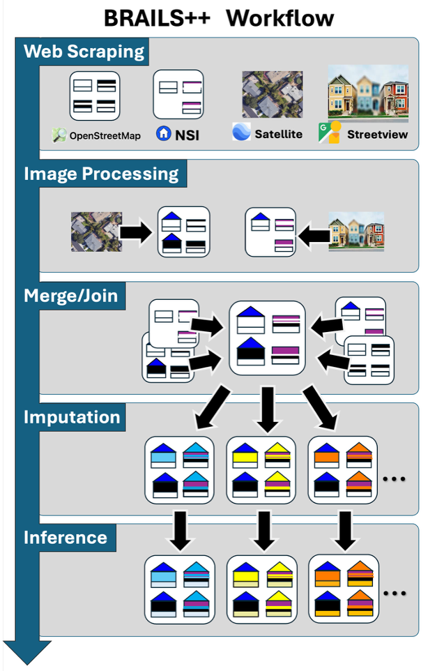

<h1 style="text-align: center;">BRAILS++: Building Regional Asset Inventories for Large Scale Simulation</h1>

[](https://github.com/NHERI-SimCenter/BrailsPlusPlus/actions/workflows/tests.yml/badge.svg)
[](https://zenodo.org/badge/latestdoi/184673734)
[](https://pypi.org/project/BRAILS/)
[](https://pypi.python.org/pypi/BRAILS/)

## What is it?

```BRAILS++``` is an object-oriented framework for building applications that focus on generating asset inventories for large geographic regions.


 BRAILS++ provides modular workflows for generating inventories by integrating diverse data sources, including public datasets, features extracted from imagery, and ruleset-based inference models.

In BRAILS++, an asset inventory consists of geographically referenced points, line-strings, or polygons, each annotated with key attributes. To build these inventories, the data scrapers in BRAILS++ interact with web servers in an automated manner and directly retrieve asset information from public datasets to create an inventory blueprint suitable as a starting point for regional-scale analysis. Example datasets accessed through BRAILS++ include FEMA’s USA Structures (FEMA, 2022), Microsoft Footprints (Microsoft, 2022), Overture Maps (Overture Maps Foundation, 2023), OpenStreetMap (OpenStreetMap contributors, 2017), the U.S. Army Corps of Engineer’s NSI, TIGER/Line roadway data (U.S. Census Bureau, 2024), FHWA’s National Bridge and Tunnel Inventories (FHWA, 2023; FHWA, 2024), ASCE REST services for design loads (ASCE, 2025), and HIFLD infrastructure data (U.S. Department of Homeland Security, 2024).




Despite their value, these datasets often contain incomplete or inconsistent information, requiring further enhancement to address the corresponding uncertainties in these high-resolution inventories. BRAILS++ incorporates methods for handling missing data and enhancing the available datasets through modules that enable: 1) feature extraction fro
m publicly available images, e.g. Google Street View, NHERI Rapid using neural networks and vision-language models; 2) inventory merging to integrate metadata from various sources and resolve inconsisties, such as differening metadata values and spatial issues e.g. misaligned footprints ; 3) statistical imputation to generate pluasable inventories with all features defined for all assets given some assets will have missing features and finally 4) data inference to add asset attributes for which no information exists for any asset based on existing information, e.g. building codes applicable at the time of construction can be used to infer typical connection details (Kijewski-Correa et al., 2022) such as roof-to-wall connections for wind vulnerability assessments.


## How is the repo laid out?

+ ```brails```: A directory containing the classes
  - ```brails/types```: directory containing useful datatypes, e.g., ```ImageSet``` and ```AssetInventory```
  - ```brails/processors```: directory containing classes that do ```image_processing``` to make predictions, e.g. RoofShape
  - ```brails/scrapers```: directory containing classes that do internet downloads, e.g., footprint and image scrapers.
  - ```brails/filters```: directory containing image filters, e.g., classes that take images and revise or filter out unnecessary portions of images.
  - ```brails/imputers```: directory containing classes that fill in missing ```AssetInventory``` datasets, i.e., filling in features that are missing in certain Assets of the AssetInventory.
  - ```brails/inferers```: directory containing classes that infer new asset features based on existing features in the Assets of ```AssetInventory```.
  - ```brails/utils```: directory containing misc classes that do useful things, e.g. geometric conversions
+ ```examples```: A directory containing example scripts and Jupyter notebooks
+ ```tests```: A directory containing unit tests. The directory structure follows that of ```brails```

## Quick Links

- [Documentation & Guides](https://nheri-simcenter.github.io/BrailsPlusPlus/)

## Installation instructions

```shell
pip install brails
```

## Acknowledgments

This work is based on material supported by the National Science Foundation under grants CMMI 1612843 and CMMI 2131111.

## Contributors

Want to see who made this possible? Check out the full list of contributors [here](./contributors.md).

## Contact

NHERI-SimCenter nheri-simcenter@berkeley.edu

<!-- todo: instructions on how to lint the code, and specific subfolder or file. -->
<!-- todo: example with the test suite. -->
<!-- todo: instructions on how to run the tests -->
<!-- todo: instructions on how to check coverage -->
<!-- python -m pytest tests --cov=brails --cov-report html -->
